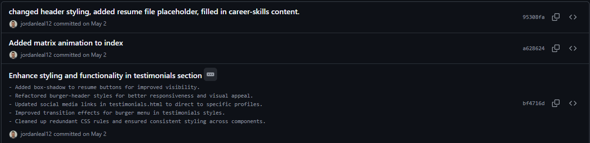

# Version Control & Testing Evaluation

## Comparing Version Control Systems

Version control systems are an essential tool in modern software development, with only 1.38% of professional developers opting out of use, according to the most recent relevant survey by StackOverflow in 2022.[^1]

|                                          |
| :---------------------------------------------------------------------------------------------: |
| _2022 StackOverflow Survey response to "What are the primary version control systems you use?"_ |

The survey also covered which version control platforms are the most popular for professional and personal use.

|                                    |
| :-------------------------------------------------------------------------------------------: |
| _2022 StackOverflow Survey response to "What version control hosting service are you using?"_ |

Referencing the above surveys, we can see the most popular version control system is Git, and the two most popular hosting services are GitHub and GitLab. As such, we will be expanding upon the differences, usage and implementation of the two most popular Version Control Systems (VCS).

### Git

A free and open sourced distributed version control system, developed by Linus Torvalds in 2005, Git has a notable advantage over other source code managers (SCM's) in its approach to merging and branching. By notating only the differences between branches, rather than creating full copies of each branch, Git saves considerable time and storage in handling branching and merging.[^2] [^3]

The way Git handles this approach is through its core difference to delta based version control systems - rather than storing information as a list of file based changes, Git only stores new or changed data, 'linking' to previously saved data for anything that remains unchanged - even within the same file![^4]

Another significant advantage of Git is its offline capabilities. With each user cloning the entire repository to their local machine, commits can be made locally, making offline testing of updated code far more feasible. Due to the aforementioned advantages in branching and merging, pushes and pulls can be made between the user machine and main server with little impact on network traffic.[^5]

With an overwhelming lead in user popularity (96.65% of professional users), Git has an amazing open source community, with over 90% of Fortune 100 companies using GitHub, it is an essential tool for any developer to master.[^6]

### Apache Subversion (SVN)

Also open sourced, SVN was built by CollabNet in 2000 as a successor to the then popular Concurrent Versions System. Absorbed by Apache in 2009, it is currently the second most popular VCS and most popular _centralized_ VCS available.[^7]

Differing from Gits distributed VCS approach which has the complete codebase stored on every developers computer, SVN's centralized VCS has all project files stored on a central repository server. Like Git, SVN allows for branching and merging from the main 'trunk', however these branches are stored as sub-folders of the central repository server. [^8]

### GIT vs SVN

- SVN has granular access control, allowing for the restriction of access to specific parts of the repository. Git does not.[^9]
- Git is purported to have a harder learning curve than SVN with its additional features in staging, committing and merging.
- SVN excels in compression of large binary files compared to git.[^8]
- Git has offline access and far lower latency compared to SVN as most data is stored locally.
- SVN is far less protected from data loss with only one central repository vs multiple distributed copies with Git.
- Git does not enforce atomic commits unlike SVN, allowing for more reliable committing of data.[^10]
- SVN lacks speed and performance compared to Git, since local operations aren't limited by network bandwidth and latency
- Despite SVN still having strong community support, it pales compared to the support offered for Git & its platforms
- SVN tracks changes to directories, renames and file metadata, vs file content only from Git[^10]

|                             |                                     **Git**                                     |                        **SVN**                         |
| :-------------------------: | :-----------------------------------------------------------------------------: | :----------------------------------------------------: |
|          **Type**           |                                   Distributed                                   |                      Centralized                       |
| **Granular Access Control** |                                       No                                        |                          Yes                           |
|     **Learning Curve**      |                                 More difficult                                  |                         Easier                         |
| **Binary File Compression** |                                  Not optimized                                  |                    Highly efficient                    |
|     **Offline Access**      |                                       Yes                                       |                           No                           |
|    **Data Preservation**    |                    Strong due to multiple distributed copies                    |     Vulnerable, data only exists on central server     |
|     **Atomic Commits**      |                                       No                                        |                          Yes                           |
|   **Speed & Performance**   | Excellent - Local changes not limited by network and only adds data for changes | Relatively Poor - Delta based VCS & limited by network |
|    **Community Support**    |                                Extremely robust                                 |           Robust but lacking compared to Git           |
|     **Change Tracking**     |                                  File content                                   |          Directories, renames & file metadata          |

#### Use Cases

Git is preferable for projects that require flexibility, offline work flow, open source projects, and the flexibility to work with a range of environments and distributed teams.

SVN is preferable for projects that require more top down control of secure access, working with large binary files, projects requiring precise auditability and working with teams already familiar with SVN or requiring an easier learning curve.[^8] [^10]

## Standard Source Control Process - Git & Github

Following standard process for source control is essential when working as a software engineer and integrating into teams, or even when contributing and collaborating on open source projects. As Github was the version control system used in my later referenced personal portfolio project, I will be covering the standard process for its use.

While there is technically no standard process for GitHub, GitHub docs does provide its own recommendation - referred to as 'GitHub Flow'.[^11] An existing repository and existing GitHub account are listed as pre-requisites. If the existing repository is not the users, a clone needs to be pulled to the local users machine.

**1. Create a branch:**
Ideally, a separate branch should be created for "each set of unrelated changes", such as a new feature or a specific bug-fix. This branch will take a 'snapshot' of the existing code at the time of branching, and any changes made to the branch will not effect existing code (for now). Creating a new branch can be done through the GitHub website or application, and for WSL users the command is:

```bash
git checkout -b [branch_name]
```

with the words following `-b` being the name of the new branch.[^12]

**2. Make changes**
Each new branch is a safe place for making changes without worrying about the main branch. GitHub flow dictates that for each isolated, complete change in the branch, said changes should be staged then committed, ensuring easy reversion if required, and making new changes distinct and readable when merging to main branch. Each commit should contain a concise, descriptive message outline the changes made. The commands for WSL users is as follows:

```bash
git add . #This stages all files
git add [file_name] #This stages specific files by name
```

_Adds files to the staging area_

```bash
git commit -m "Your commit message"
```

_Commits files with commit message_

```bash
git push --set-upstream origin [branch_name] #Ensures changes are pushed to new branch
```

_Pushes the commit to the remote repository, creating a backup and preparing for the next step_

**3. Create a pull request**
Once the desired changes are completed in the branch, it's time to create a pull request, outlining explicitly what the new changes are and requesting feedback from project collaborators, prior to merging.

Although a pull request can technically be done using the terminal only, best practice is to use the GitHub website or application, as changes in files can be compared and the description for the pull request can be created using markdown.[^13]

From the main page of the repository located on GitHub, select the relevant branch using the drop-down:


This will take you to the branch page, showing the branch files with a yellow banner above them to create the pull request:


Ensure that the two drop down menu's denote the branch you desire to merge with an arrow pointing to the main branch to be merged into. Add a short descriptive title, and fill in the markdown supported description, ensuring to add as much detail as required for collaborators to easily understand your changes. [^14]

**4. Review feedback**
Lead collaborators working on the project will provide feedback on the pull request, either approving it or requesting specific changes. Changes can still be committed and pushed to the relevant branch, in response to feedback with the description being updated and adding comments accordingly, until approval to merge is received.

**5. Merging the pull request**
Once approval is received the branch can be merged. If no conflicts arise, the "merge pull request" option will be available, adding all commits to the base branch and providing an option to delete the offshoot branch:


Should conflicts exist, refer to [this GitHub documentation](https://docs.github.com/en/pull-requests/collaborating-with-pull-requests/addressing-merge-conflicts) and lead collaborators to resolve.

**6. Delete your branch**
Since every pull, commit and messaged is safely recorded, there's no reason to keep the old branch around. Delete the branch, keeping the source control clean.

## How My Project Utilized Source Control

The example of my application of source control will reference my previous personal portfolio website. The history of commits and commit messages can be found [on this GitHub page.](https://github.com/jordanleal12/portfolio-website/commits/main/) An example of some commits and their messages are as follows:


As a solo project, this particular project did not place an emphasis on proper utilization of proper source control procedure, as a result I will illustrate the changes to usage of source control required for this project to be more compliant, and the benefits of doing so even on a solo project.

**1. More detail in commit messages:** Though some commit messages added detailed dot points, many lacked enough context and detail to understand what changes where made. On solo projects, this is still important when referencing work in the future or when working on a large complex project where memory cannot be relied upon.
**2. Making a commit for each isolated, complete change:** Some commits on this project contained multiple isolated changes, or incomplete changes. Even on a solo project, isolated complete commits allow for far greater readability of code changes, easier revision of code and greater isolation for bug fixes.
**3. Utilizing branching and merging:** Although this may seem counter-intuitive for solo projects where only one person will be working on the code at any given time, creating branches still has many benefits. Isolating new features can provide easier bug fixing and identification, allow the main code to be expanded upon while temporarily shelving an incomplete branch, and allowing for the building of a basic, safe functional base code while still having the ability to safely add complexity and greater functionality.
**4. Detailed pull request descriptions:** An additional benefit to using branches is the ability to add markdown flavoured descriptions of each branch to be merged with the main branch. Although commit messages are useful for adding context, pull request descriptions provide a picture of the functionality of the whole branch and the sum of its commits. The ability to add images, links, tables etc. in markdown grant a much greater descriptive ability than commit messages alone could.

## Standard Testing Process

[^1]: [2022 StackOverflow Survey](https://survey.stackoverflow.co/2022/#section-version-control-version-control-systems)
[^2]: [Git vs SVN - Nulab](https://nulab.com/learn/software-development/git-vs-svn-version-control-system/)
[^3]: [Branching & Merging - Git](https://git-scm.com/about/branching-and-merging)
[^4]: [What is Git? - Git](https://git-scm.com/book/en/v2/Getting-Started-What-is-Git%3F)
[^5]: [Git vs SVN - GitKraken](https://www.gitkraken.com/blog/git-vs-svn)
[^6]: [Github Statistics - Kinsta](https://kinsta.com/blog/github-statistics/)
[^7]: [SVN - Wikipedia](https://en.wikipedia.org/wiki/Apache_Subversion)
[^8]: [SVN Vs Git - Linode](https://www.linode.com/docs/guides/svn-vs-git/)
[^9]: [Granular Access Control - Instasafe](https://instasafe.com/blog/what-is-granular-access-control/)
[^10]: [Differences Between Git & SVN - GeeksForGeeks](https://www.geeksforgeeks.org/git/difference-between-git-and-svn/)
[^11]: [GitHub Flow - GitHub](https://docs.github.com/en/get-started/using-github/github-flow#following-github-flow)
[^12]: [Creating Repositories - Github](https://docs.github.com/en/get-started/start-your-journey/hello-world)
[^13]: [CLI Pull Request - GitHub](https://cli.github.com/manual/gh_pr_create)
[^14]: [Pull Requests - GitHub](https://docs.github.com/en/pull-requests/collaborating-with-pull-requests/proposing-changes-to-your-work-with-pull-requests/creating-a-pull-request)
