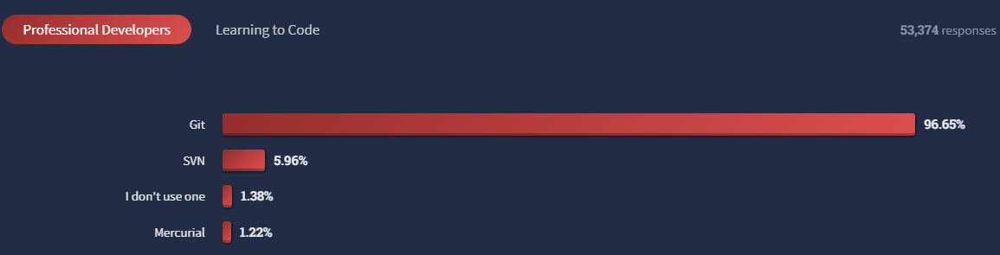
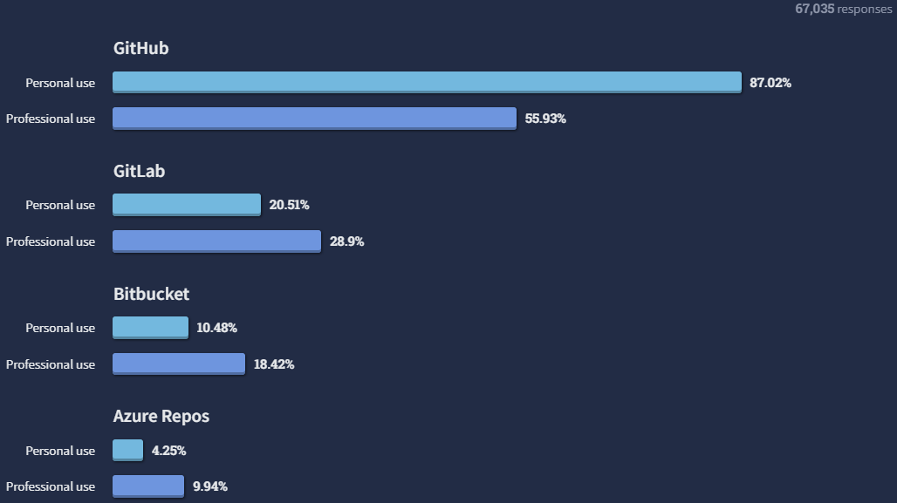
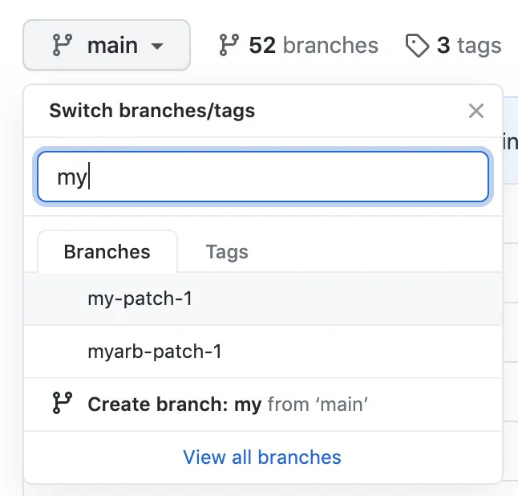
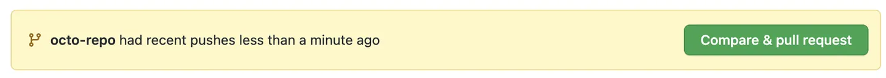
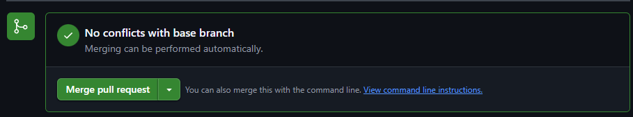
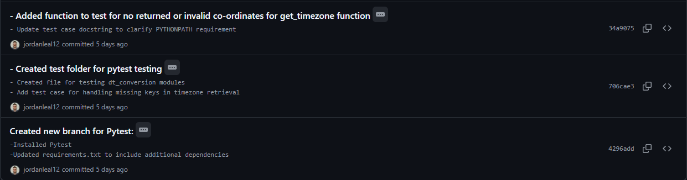
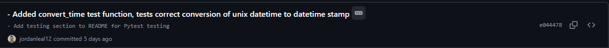
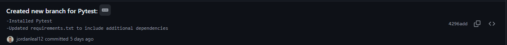

# Version Control & Testing Evaluation

## Comparing Version Control Systems

Version control systems are an essential tool in modern software development, with only 1.38% of professional developers opting out of use, according to the most recent relevant survey by StackOverflow in 2022.[^1]

|                                          |
| :---------------------------------------------------------------------------------------------: |
| _2022 StackOverflow Survey response to "What are the primary version control systems you use?"_ |

The survey also covered which version control platforms are the most popular for professional and personal use.

|                                    |
| :-------------------------------------------------------------------------------------------: |
| _2022 StackOverflow Survey response to "What version control hosting service are you using?"_ |

Referencing the above surveys, we can see the most popular version control system is Git, and the two most popular hosting services are GitHub and GitLab. As such, we will be expanding upon the differences, usage and implementation of the two most popular Version Control Systems (VCS).

### Git

A free and open sourced distributed version control system, developed by Linus Torvalds in 2005, Git has a notable advantage over other source code managers (SCM's) in its approach to merging and branching. By notating only the differences between branches, rather than creating full copies of each branch, Git saves considerable time and storage in handling branching and merging.[^2] [^3]

The way Git handles this approach is through its core difference to delta based version control systems - rather than storing information as a list of file based changes, Git only stores new or changed data, 'linking' to previously saved data for anything that remains unchanged - even within the same file![^4]

Another significant advantage of Git is its offline capabilities. With each user cloning the entire repository to their local machine, commits can be made locally, making offline testing of updated code far more feasible. Due to the aforementioned advantages in branching and merging, pushes and pulls can be made between the user machine and main server with little impact on network traffic.[^5]

With an overwhelming lead in user popularity (96.65% of professional users), Git has an amazing open source community, with over 90% of Fortune 100 companies using GitHub, it is an essential tool for any developer to master.[^6]

### Apache Subversion (SVN)

Also open sourced, SVN was built by CollabNet in 2000 as a successor to the then popular Concurrent Versions System. Absorbed by Apache in 2009, it is currently the second most popular VCS and most popular _centralized_ VCS available.[^7]

Differing from Gits distributed VCS approach which has the complete codebase stored on every developers computer, SVN's centralized VCS has all project files stored on a central repository server. Like Git, SVN allows for branching and merging from the main 'trunk', however these branches are stored as sub-folders of the central repository server. [^8]

### GIT vs SVN

- SVN has granular access control, allowing for the restriction of access to specific parts of the repository. Git does not.[^9]
- Git is purported to have a harder learning curve than SVN with its additional features in staging, committing and merging.
- SVN excels in compression of large binary files compared to git.[^8]
- Git has offline access and far lower latency compared to SVN as most data is stored locally.
- SVN is far less protected from data loss with only one central repository vs multiple distributed copies with Git.
- Git does not enforce atomic commits unlike SVN, allowing for more reliable committing of data.[^10]
- SVN lacks speed and performance compared to Git, since local operations aren't limited by network bandwidth and latency
- Despite SVN still having strong community support, it pales compared to the support offered for Git & its platforms
- SVN tracks changes to directories, renames and file metadata, vs file content only from Git[^10]

|                             |                                     **Git**                                     |                        **SVN**                         |
| :-------------------------: | :-----------------------------------------------------------------------------: | :----------------------------------------------------: |
|          **Type**           |                                   Distributed                                   |                      Centralized                       |
| **Granular Access Control** |                                       No                                        |                          Yes                           |
|     **Learning Curve**      |                                 More difficult                                  |                         Easier                         |
| **Binary File Compression** |                                  Not optimized                                  |                    Highly efficient                    |
|     **Offline Access**      |                                       Yes                                       |                           No                           |
|    **Data Preservation**    |                    Strong due to multiple distributed copies                    |     Vulnerable, data only exists on central server     |
|     **Atomic Commits**      |                                       No                                        |                          Yes                           |
|   **Speed & Performance**   | Excellent - Local changes not limited by network and only adds data for changes | Relatively Poor - Delta based VCS & limited by network |
|    **Community Support**    |                                Extremely robust                                 |           Robust but lacking compared to Git           |
|     **Change Tracking**     |                                  File content                                   |          Directories, renames & file metadata          |

#### Use Cases

Git is preferable for projects that require flexibility, offline work flow, open source projects, and the flexibility to work with a range of environments and distributed teams.

SVN is preferable for projects that require more top down control of secure access, working with large binary files, projects requiring precise auditability and working with teams already familiar with SVN or requiring an easier learning curve.[^8] [^10]

## Standard Source Control Process - Git & Github

Following standard process for source control is essential when working as a software engineer and integrating into teams, or even when contributing and collaborating on open source projects. As Github was the version control system used in my later referenced personal portfolio project, I will be covering the standard process for its use.

While there is technically no standard process for GitHub, GitHub docs does provide its own recommendation - referred to as 'GitHub Flow'.[^11] An existing repository and existing GitHub account are listed as pre-requisites. If the existing repository is not the users, a clone needs to be pulled to the local users machine.

**1. Create a branch:**
Ideally, a separate branch should be created for "each set of unrelated changes", such as a new feature or a specific bug-fix. This branch will take a 'snapshot' of the existing code at the time of branching, and any changes made to the branch will not effect existing code (for now). Creating a new branch can be done through the GitHub website or application, and for WSL users the command is:

```bash
git checkout -b [branch_name]
```

with the words following `-b` being the name of the new branch.[^12]

**2. Make changes**
Each new branch is a safe place for making changes without worrying about the main branch. GitHub flow dictates that for each isolated, complete change in the branch, said changes should be staged then committed, ensuring easy reversion if required, and making new changes distinct and readable when merging to main branch. Each commit should contain a concise, descriptive message outline the changes made. The commands for WSL users is as follows:

```bash
git add . #This stages all files
git add [file_name] #This stages specific files by name
```

_Adds files to the staging area_

```bash
git commit -m "Your commit message"
```

_Commits files with commit message_

```bash
git push --set-upstream origin [branch_name] #Ensures changes are pushed to new branch
```

_Pushes the commit to the remote repository, creating a backup and preparing for the next step_

**3. Create a pull request**
Once the desired changes are completed in the branch, it's time to create a pull request, outlining explicitly what the new changes are and requesting feedback from project collaborators, prior to merging.

Although a pull request can technically be done using the terminal only, best practice is to use the GitHub website or application, as changes in files can be compared and the description for the pull request can be created using markdown.[^13]

From the main page of the repository located on GitHub, select the relevant branch using the drop-down:


This will take you to the branch page, showing the branch files with a yellow banner above them to create the pull request:


Ensure that the two drop down menu's denote the branch you desire to merge with an arrow pointing to the main branch to be merged into. Add a short descriptive title, and fill in the markdown supported description, ensuring to add as much detail as required for collaborators to easily understand your changes. [^14]

**4. Review feedback**
Lead collaborators working on the project will provide feedback on the pull request, either approving it or requesting specific changes. Changes can still be committed and pushed to the relevant branch, in response to feedback with the description being updated and adding comments accordingly, until approval to merge is received.

**5. Merging the pull request**
Once approval is received the branch can be merged. If no conflicts arise, the "merge pull request" option will be available, adding all commits to the base branch and providing an option to delete the offshoot branch:


Should conflicts exist, refer to [this GitHub documentation](https://docs.github.com/en/pull-requests/collaborating-with-pull-requests/addressing-merge-conflicts) and lead collaborators to resolve.

**6. Delete your branch**
Since every pull, commit and messaged is safely recorded, there's no reason to keep the old branch around. Delete the branch, keeping the source control clean.

## How My Project Utilized Source Control

The example of my application of source control will reference my previous CLI custom software application. The history of commits and commit messages can be found [on this GitHub page.](https://github.com/jordanleal12/assignment-2-custom-software/commits/main/)

As a solo project, it could be thought that there is no need to use proper source control procedure. This is incorrect, and as such I will illustrate the usage of source control in this project, and the benefits of doing so even on a solo project.

**1. Detailed commit messages:** On solo projects, this is still important when referencing work in the future or when working on a large complex project where memory cannot be relied upon. Here are some examples of sufficiently detailed commits and their messages from my project:


**2. Making a commit for each isolated, complete change:** Even on a solo project, isolated complete commits allow for far greater readability of code changes, easier revision of code and greater isolation for bug fixes. In the provided example below, you can see the complete isolated change is the addition of a single function, with the name and purpose of function provided, and a relevant update to the Readme.


**3. Utilizing branching and merging:** Although this may seem counter-intuitive for solo projects where only one person will be working on the code at any given time, creating branches still has many benefits. Isolating new features can provide easier bug fixing and identification, allow the main code to be expanded upon while temporarily shelving an incomplete branch, and allowing for the building of a basic, safe functional base code while still having the ability to safely add complexity and greater functionality.
As can be seen below, a new branch was created for each implementation of a new testing procedure for my project:


**4. Detailed pull request descriptions:** An additional benefit to using branches is the ability to add markdown flavoured descriptions of each branch to be merged with the main branch. Although commit messages are useful for adding context, pull request descriptions provide a picture of the functionality of the whole branch and the sum of its commits. The ability to add images, links, tables etc. in markdown grant a much greater descriptive ability than commit messages alone could. An example of a detailed pull request from my project can be found [in this GitHub page.](https://github.com/jordanleal12/assignment-2-custom-software/pull/2)

## Standard Testing Process

Testing is a vital part of development - ensuring functioning code and identifying errors (hopefully) before the user does. Testing can be grouped into two main categories: Automated and Manual. With multiple types of testing falling under both categories, we will be looking at the three most relevant standard testing processes used in my CLI application.

### 1. Unit testing

Unit testing is a zoomed in form of testing that focuses on specific entities in the code - being classes, functions etc, and ensuring that they function as expected given known data.
One of the most common tools used for unit testing is Pytest, which uses mock data to simulate parts of the code, isolating the entity as much as possible and asserting the output matches expectations.[^15]

An example of use in my code is as follows:

```python
def test_convert_time(monkeypatch):
    """Test that convert_time converts unix timestamp to expected datetime given timezone."""
    # Make get_timezone always return "UTC"
    monkeypatch.setattr(dtc, "get_timezone", lambda coords: "UTC")
    # 1609459200 = 2021-01-01 00:00:00 UTC
    result = dtc.convert_time(1609459200, {"lat": 0, "lon": 0})
    # Format is "%d-%b-%y %I:%M %p %Z", so we expect: 01-Jan-21 12:00 AM UTC
    assert result == "01-Jan-21 12:00 AM UTC"
```

As we can see above, Pytest and Monkeypatch are being used to test the function `convert_time`. Monkey patch is being used to simulate output from the `get_timezone` and return "UTC" always. This isolates the `convert_time` function from the `get_timezone` function, helping us test its output without calling other functions.
A known unix timestamp is then passed to the function, and Pytest is used to assert that the function converts and returns the expected value correctly.

### 2. Integration Testing

A step up in complexity, integration testing tests two or more entities simultaneously, as well as their interaction with each other. To put it more simply, if unit testing tests a single unit, integration testing tests multiple units working together.[^16]
Of course this can make it more difficult to isolate the precise issue when integration testing fails - it is for this reason that integration testing and unit testing work hand in hand to help identify and isolate faults in the code.
Pytest can also be used for integration testing, often alongside other modules required to emulate parts of the code (such as API calls).

An example of use in my code is as follows:

```python
def test_get_weather_data_success(requests_mock, monkeypatch):
    """Test successful retrieval of weather data from the API."""

    #Prepare a fake JSON payload
    fake_json = {
   "coord": {
      "lon": 0,
      "lat": 0
   },
   "weather": [
      {
         "main": "Rain",
         "description": "clear sky",
      }
   ],
   "main": {
      "temp": 22.5,
      "humidity": 55,
   },
   "dt": 1609459200,
   "name": "TestCity",
   "cod": 200
}

    # Intercept the GET request, regardless of params, return our fake JSON
    requests_mock.get(
        "https://api.openweathermap.org/data/2.5/weather",
        json=fake_json,
        status_code=200
    )

    # --- Act ---
    ws = WeatherService(api_key="DUMMY_KEY")
    result = ws.get_weather_data("TestCity")

    # --- Assert ---
    assert result["city"] == "TestCity"
    assert result["temperature"] == 22.5
    assert result["humidity"] == 55
    assert result["condition"] == "clear sky"
    assert (
        result["local_time"] == "01-Jan-21 12:00 AM UTC" or
        result["local_time"] == "01-Jan-21 12:00 AM GMT"
    )
```

The above tests the functionality of the `get_weather_data` method and `convert_time` function in tandem. A fake json is created to mimic data passed from the API, allowing us to bypass the API call for more isolated testing. Since the `convert_time` function has already been unit tested, rather than replacing it out with monkeypatch we can test its integration with the `get_weather_data` method at this point to, feeding it a unix timestamp from the fake json.

Normally the `get_weather_data` method will use requests.get to contact the API, however for the integration test we replace that with requests_mock.get, which gives a pre-determined response without actually contacting the API. This allows us to test with consistent input.

The result is the creation of an instance of the parent class `WeatherService`, which calls the `get_weather_data` method. We fake the URL request using requests_mock and pass the method the fake json, using pytest to assert that each piece of the output has been processed correctly by both functions. 'UTC' or 'GMT' are both accepted as it's the same timezone which some systems label differently.

### 3. Smoke Test

Put simply, smoke testing is ensuring the major features of the application work as intended. As a manual test, this is very easy to imagine. Say you're testing a CLI application - simply follow the provided instructions, and attempt to use the application as intended.[^17]

For an automated process, this involves running pre-determined script(s), mimicking normal, expected user input, and asserting the output matches expectations.

An example of use in my code is as follows:

```python
class DummyHandler:
    """A simple dummy output handler to simulate terminal output."""

    def output(self, data):
        """Simulate outputting data to the terminal."""
        print(f"OUTPUT: {data}")


class InputDriver:
    """A class to simulate user input for testing purposes."""

    def __init__(self, responses):
        self._iter = iter(responses)

    def __call__(self, prompt=""):
        return next(self._iter)

def test_cli_happy_path(monkeypatch, capsys):
    """Test the main() function in main.py with a happy path scenario."""

    monkeypatch.setenv("OWM_API_KEY", "DUMMY")

    # Stub out the network call so we always get a valid dict
    monkeypatch.setattr(
        WeatherService, "get_weather_data",
        lambda self, city: {
            "city": city,
            "temperature": 20,
            "humidity": 50,
            "condition": "sunny",
            "local_time": "01-Jan-21 12:00 AM UTC"
        }
    )

    # Patch the class imported in main.py
    monkeypatch.setattr(main, "TerminalOutput", DummyHandler)

    # Simulate typing: [menu choice, city name, exit]
    responses = ["1", "TestCity", "exit"]
    monkeypatch.setattr(builtins, "input", InputDriver(responses))

    # Run main(); it'll call exit() on "exit", so catch the SystemExit
    with pytest.raises(SystemExit):
        main.main()

    # Grab what was printed and verify our DummyHandler ran
    out = capsys.readouterr().out
    assert "OUTPUT: {'city': 'testcity', 'temperature': 20, 'humidity': 50" in out
```

Although verbose, the above process is fairly simple:

- The app requires an API key which is faked using `monkeypatch.setenv`
- The API call is bypassed using `monkeypatch.setattr` and a fixed fake response is received
- The real terminal output is replaced with the `DummyHandler` class, to allow testing of the output
- The user inputs are faked using `monkeypatch.setattr` and the `InputDriver` class to simulate menu selection and city name entry
- The app is run, and calls `exit()` is raised to test app exiting
- App output is captured by `capsys.readouterr()`
- The output is asserted by pytest to ensure that the output matches expectations

## Test Driven Development

Test driven development (TDD) is the practice of writing tests for your code _before_ writing the code, with the expectation of failure. The code is then written after the fact until the test is passed. The three steps of TDD are as follows:
**1. Test (Red Stage):** A test is designed for a _single key element_ of your code, with the expectation of failure.
**2. Code (Green Stage):** The code required to pass the test is written, ideally to the lowest required standard of passing the test.
**3. Refactor:** The completed code is refactored to be more efficient and inline with desired functionality.[^18]

Using TDD allows for a much more mindful path for writing code. Rather than being stuck trying to determine which part of the code to work on next - Assess a basic required functionality, create a test for it, then add code until you can pass that test.

We can look at some examples using the CLI application below:

**Test stage -** The element we desire to test in this case is an extension checker, which takes the user input for desired file name and checks that is has the correct extension. As this has multiple functionalities, we will specifically design a test for the element that adds the correct file extension if it isn't provided with the filename.

The test is as follows:

```python
def test_adds_missing_extension():
    # GIVEN a filename without “.csv”
    filename = "data"
    # WHEN I run extension_checker
    result = extension_checker(filename, ".csv")
    # THEN it should tack on “.csv”
    assert result == "data.csv"
```

After running the test in pytest, it spits out the following - `FAILED tests/test_extension_checker.py::test_adds_missing_extension - AssertionError: assert None == 'data.csv'`

**Code Stage -** Now we write the code required to pass the test:

```python
def extension_checker(filename, f_type)
    ext = os.path.splitext(filename)[1]
    filename += f_type
    return filename
```

After running the above code in pytest, we get a message letting us know it passes the test!

**Refactor Stage -** After achieving the bare minimum required functionality to pass the test, we can now refactor the code, increasing readability and functionality:

```python
def extension_checker(filename: str, f_type: str) -> str:
    """Checks the file extension and returns the filename with the correct extension."""

    ext = os.path.splitext(filename)[1].lower() # Get the file extension from the filename
    if not ext:
        print(f"Missing file extension, adding {f_type}")
        filename += f_type # Add the correct file extension if missing
    return filename
```

We can now repeat the above steps for the functionality of replacing an incorrect file path input with the correct one! after repeating the three steps again our completed function will look like this:

```python
def extension_checker(filename: str, f_type: str) -> str:
    """Checks the file extension and returns the filename with the correct extension."""

    ext = os.path.splitext(filename)[1].lower() # Get the file extension from the filename
    if ext and ext != f_type:
        print(f"Invalid file extension, converting to {f_type}")
        filename = filename.replace(ext, f_type) #replace the existing extension with the correct one
    if not ext:
        print(f"Missing file extension, adding {f_type}")
        filename += f_type # Add the correct file extension if missing
    return filename
```

## Incorporating Testing Within Recent Project

As my first ever CLI python application, there was inevitably countless challenges and potential improvements for the testing process. As such, I'll focus on the four most relevant challenges, outlining the challenge I faced, the impact it had on the project, what I did to fix it and how my process could be improved in the future.

Considering our cohort skipped the unit on testing prior to building our CLI applications, many parts of the application that where tested manually could have been significantly expedited using automated testing. Writing the code using TDD practices would have also been significantly beneficial to providing direction, as there were many times I was stuck thinking "now what?".

### Parsing Local DateTime from API

**1. The Challenge:** When processing and retrieving datetime using the API call, then converting to localized datetime, the time was inaccurate, usually roughly ~5 minutes behind. For example if I was to get a weather report for Sydney, I could see that the timestamp was behind what my local time was.

**2. The Impact:** I spent hours going over my code looking for bugs, refactoring things to try and get it to work and browsing forums as well as the OpenWeatherMap API docs - convinced it was an issue with my code!

**3. The Solution:** After finally discovering the issue wasn't with my code, but rather that the API only received weather updates every 5-10 minutes, I added information to my Readme page and terminal output so that the user would be made aware.

**4. The Improvements:** The most vital part of this challenge I faced is that it all could have been avoided with the use of correct testing procedure. Using requests_mock and pytest, I could have designed a unit test and integration test to provide a fake json response from my API and test if my code was processing the received datetime information correctly. This would have isolated that the issue was coming from the API end rather than my code, expediting the trouble shooting process. The 'Integration Testing' example under the 'Standard Testing Procedure' provides an example of the appropriate test.

Further improvements to the code could be made by adding context to the time stamp - eg. "Weather Data last updated x minutes ago", using the DateTime module to compare the timestamp to the current time.

**5. The User Experience:** Initially, feedback was received that the time stamp wasn't accurate. Test users mentioned that this gave them concerns for the reliability of the application, if that part wasn't accurate what else might not be accurate? After updating the Readme and terminal output explaining the time difference, the test users made no further mention.

If the implementation of adding context to the timestamp as mentioned above was to go ahead, user feedback would be requested to see if it garnered a more positive response.

**6. Ethical Considerations:** Referring to Code of Ethics (COE)[^19] and Ethical Web Principles (EWP)[^20]

- **COE 1.06 - Avoid deception:** By initially not providing the context for the difference in the localized time received by the user and the actual time, I misled the user with the claim of "current" weather data and time. Such errors can have legal ramifications when delivering applications as a real service in the industry.
- **EWP 2.10 - Transparency:** Initially, the information about the time difference was only available in the Readme, which lacked transparency. Alerting users in the terminal output addressed this issue.
- **COE 6.07 - Accurate characteristics:** Integrating the proposed feature to show the difference between provided time and current time would give the user a more accurate assessment of the characteristics of the data being provided through the software.

### API Key Activation and Error Handling

**1. The Challenge:** Part of my testing procedure was providing my completed code to some friends of mine, having them follow the Readme instructions, and having them attempt to use the application start to finish - a manual smoke test using beta testers on different devices and operating systems. The testing ran into an early speed-bump, being that any request made returned the following errors:

```
HTTP Error: 401 - Unauthorized
Value Error: No data found for the specified city.
```

**2. The Impact:** A quick search revealed that a 401 error is provided when the request lacks valid authentication credentials.[^21] Initially, I thought this to be an easy fix, I hadn't added instructions for the tester to verify their email upon sign-up for their API key, and after adding this to the Readme I was assured this would be fixed. However, even after verifying the user email, the same error was being returned. Moreover, when creating new accounts myself I was receiving the same error.

This led me down another wild goose chase - manually adding API keys to requests in the browser, searching through code, researching .env integration etc. To add further confusion, some of the API keys had no started working, while others continued to not work. Eventually this led me to realize that the error was being caused by a ~30-60 minute delay between receiving the API key and the key being activated.

**3. The Solution:** After realizing that the issue was with the delay for activation rather than a code error, the Readme was updated to convey this new information, and a pre-activated API key was provided in the Readme purely for testing purposes (this would not be included in a real release for security reasons).

**4. The Improvements** This is another example of how using proper testing procedure could have caught the cause of the error much earlier. Using requests_mock to create tests simulating API response without actually contacting the API would have allowed my beta testers to confirm that the code ran correctly on their local instances. This would have allowed us to isolate the API call as a problem on the API side.

Another improvement to be made in the testing procedure is a more thorough user smoke-test before sending the application off to beta testers. Although this application was smoke tested by me, I did not sign up as a new user to OpenWeatherMap, and used my existing API key, something that would have highlighted the issue much earlier. Implementation of proper API testing guidelines [as found here](https://www.functionize.com/automated-testing/automated-api-testing), would have improved and standardized my testing approach.[^22]

Finally, removing the process of having the user sign up for an API key altogether would significantly improve user experience. This could be done through two methods - transferring the API call over to a site that doesn't require an API key (eg. open-meteo)[^23]. Alternatively, using a serverless proxy to add the API key to the request in the backend, where it can't be accessed by users.

This could be done through methods such as using an API Gateway through AWS Lambda - sending a request from the application to the API Gateway - parsing the request and extracting the city name - passing the city name to a function that adds the API key and calls the OpenWeatherMap API - Receives the responses and passes it back to the python application, without ever revealing the API key.[^24]

**5. The User Experience:** This challenge had a significant impact on the experience of my test users, as they couldn't even initially access the application. Even after addressing the issue, test users noted that having to wait upwards of half an hour for the API key activation before they could even access the weather app was a significant deterrence, and undermined the convenience of the application.

Should the proposed improvement of removing the user requirement of installing their own API key be completed, user feedback on the difference in experience would be requested.

**6. Ethical Considerations:** Referring to Code of Ethics (COE)[^19] and Ethical Web Principles (EWP)[^20]

- **EWP 2.5 - Secure and private:** Although the pre-provided API key was for testing only, including it in the public Readme risks violating security principles. Implementing the proposed workarounds for API key access would remove the need for providing said API in the Readme.

### Multi-Name and Duplicate Name Cities

**1. The Challenge:** During manual testing, I quickly discovered that using cities that shared their name with other cities, or using city names with more than one word in them would often yield undesired results. Moreover, due to the geocoding function of OpenWeatherMap being depreciated, the documentation for addressing this issue was not particularly clear.

**2. The Impact:** Inefficient use of time. If test driven development had been used from the start, addressing this issue would have been much easier. Since it wasn't, I was left trying to figure out how to refactor code I had already thought to be complete. Initially, I found OpenWeatherMap provided a prebuilt json with the names and co-ordinates of thousands of cities, and I planned on importing this as a dictionary and having the user input reference the dictionary to provide correct details for the API call.

However, although this addressed the issue of multi-name cities and duplicate cities across different countries, it did not address duplicate cities within the same country. An example of this is my own hometown, Richmond:

```python
{
    "id": 2151639,
    "name": "Richmond Plains",
    "state": "",
    "country": "AU",
    "coord": {
        "lon": 143.449997,
        "lat": -36.383331
    }
},
{
    "id": 2151649,
    "name": "Richmond",
    "state": "",
    "country": "AU",
    "coord": {
        "lon": 145.001755,
        "lat": -37.818192
    }
},
{
    "id": 2151650,
    "name": "Richmond",
    "state": "",
    "country": "AU",
    "coord": {
        "lon": 150.766663,
        "lat": -33.599998
    }
}
```

As seen above, there's no way to identify which of the two Richmond's is my hometown. Not only this, it significantly complicates the ability to identify multi-name cities using a single name.

**3. The Solution:** Formatting the code to accept letters, spaces and commas only and replacing spaces with commas to correctly query the API when using multi word cities:

```python
try:
                    for char in city: # Check if the city name contains only alphabetic characters
                        if not char.isalpha() and char not in (" ", ","):
                            raise ValueError(
                                "City name must contain letters, spaces or commas only"
                                )
                    city = city.replace(" ", ",")  # Swap spaces with commas for multi-word cities
                    weather_data = service.get_weather_data(city)
```

I also provided the following instructions in the terminal output as well as the Readme instructions:
`If the city shares its name, add the ISO 3166 state and country code, (e.g. "melbourne nsw au").`

**4. The Improvements:** As mentioned above, if the code had been written from the beginning using test driven development, the issue would have been caught earlier and less re-formatting would have been required. This could have been achieved by creating a large array of city names and running an automated test to assert that cities selected from the array matched their expected co-ordinates.

A look-up table could have been implemented for city names, querying the API with the city name if only one city matched the name input, or returning a list of all matching cities by name, showing their country and state and allowing the user to select by number.

**5. The User Experience:** Prior to the implementation of the terminal output and Readme instructions for handling duplicate name cases and multi-name cities, the application was given to testers as something capable of fetching weather data from capital cities only (as they aren't effected by those edge cases). Despite this, testers still occasionally input city names that fit those edge cases, and noted that the returned values where not what they expected.

This highlighted that users couldn't be expected to know which cities are capital cities or not, and would still try non-capital cities regardless. In those cases, returning incorrect data was more harmful than returning no data, despite the outputs of capital cities only being assured.

After updating so that all city names could be handled, did not report incorrect data being returned, though it was noted that occasionally having to search for ISO 3166 codes for less familiar cities was irritating. In such a case, the implementation of the aforementioned look-up table and multi-level city selection would address these user concerns.

**6. Ethical Considerations:** Referring to Code of Ethics (COE)[^19] and Ethical Web Principles (EWP)[^20]

- **COE 3.14 - Data integrity:** Since the code initially provided to testers could provide inaccurate information when processing cities with shared names or multiple names, this did not adhere to principles of data integrity. Rectifying the processing of city names and providing context in the terminal output and Readme helped address this issue.
- **EWP 2.4 - Web for all people** By requiring the user to identify ISO 3166 country codes to parse the correct city for cities with shared names, the application fails to accommodate for peoples with less access to education or ability to search for information. This issue could be addressed with the previously mentioned lookup table solution.

### Lack of Test Driven Development

**1. The Challenge:** As touched on above, missing the module on testing meant that this CLI application was not built in line with test driven development from the beginning. Tests for the application was written after the fact, and the application was written without following the red-green-refactor cycle.

**2. The Impact:** During the development process, there were many instances in which momentum was lost deciding what to build next. The early phase of the application was particularly intimidating, with no real idea of where to begin, and the order of which the application was build was less than optimal.

Test coverage of the application had many gaps in retrospect, and although the manual testing I did was very thorough, after retroactively designing tests for the application it's clear that the testing was not as robust as it could have been.

**3. The Solution:** Retroactively added unit testing, integration testing and smoke testing, examples of which are referenced in the 'Standard Testing Process' section. I also looked at sections of my completed code and established how they would have been written if I had been following TDD, an example of which was provided in the 'Test Driven Development' section.

**4. The Solution:** For future projects, the principles of test driven development will be adhered to, and tests will be designed before/during the application creation rather than after. Appropriate types of testing will be selected from the standard testing procedures, depending on the application features (eg. API testing if the application utilizes API calls)

**5. The User Experience:** A lack of test driven development significantly impacted the user experience of my test users, notably through the emergence of many of the above mentioned errors that normally would have been captured prior to a beta version of the application being provided to testers.

**6. Ethical Considerations:** Referring to Code of Ethics (COE)[^19] and Ethical Web Principles (EWP)[^20]

- **COE 3.10 - Adequate testing, debugging and review:** As this application was designed without correctly adhering to the principles of test driven development, it does not uphold this ethical requirement to the highest standard. Retroactive testing has helped to rectify this flaw, and it is noted for future developments.
- **COE 8.05 - Improve knowledge of standards:** Through the process of reviewing testing procedure for this application, I have significantly improved my understanding of the standards required for test driven development.

[^1]: [2022 StackOverflow Survey](https://survey.stackoverflow.co/2022/#section-version-control-version-control-systems)
[^2]: [Git vs SVN - Nulab](https://nulab.com/learn/software-development/git-vs-svn-version-control-system/)
[^3]: [Branching & Merging - Git](https://git-scm.com/about/branching-and-merging)
[^4]: [What is Git? - Git](https://git-scm.com/book/en/v2/Getting-Started-What-is-Git%3F)
[^5]: [Git vs SVN - GitKraken](https://www.gitkraken.com/blog/git-vs-svn)
[^6]: [Github Statistics - Kinsta](https://kinsta.com/blog/github-statistics/)
[^7]: [SVN - Wikipedia](https://en.wikipedia.org/wiki/Apache_Subversion)
[^8]: [SVN Vs Git - Linode](https://www.linode.com/docs/guides/svn-vs-git/)
[^9]: [Granular Access Control - Instasafe](https://instasafe.com/blog/what-is-granular-access-control/)
[^10]: [Differences Between Git & SVN - GeeksForGeeks](https://www.geeksforgeeks.org/git/difference-between-git-and-svn/)
[^11]: [GitHub Flow - GitHub](https://docs.github.com/en/get-started/using-github/github-flow#following-github-flow)
[^12]: [Creating Repositories - Github](https://docs.github.com/en/get-started/start-your-journey/hello-world)
[^13]: [CLI Pull Request - GitHub](https://cli.github.com/manual/gh_pr_create)
[^14]: [Pull Requests - GitHub](https://docs.github.com/en/pull-requests/collaborating-with-pull-requests/proposing-changes-to-your-work-with-pull-requests/creating-a-pull-request)
[^15]: [What is Unit Testing? - Brightsec](https://www.brightsec.com/blog/unit-testing/#:~:text=What%20Is%20Unit%20Testing%3F)
[^16]: [Integration Testing - FullStackPython](https://www.fullstackpython.com/integration-testing.html)
[^17]: [Smoke Testing - Guru99](https://www.guru99.com/smoke-testing.html)
[^18]: [Test Driven Development - Circleci](https://circleci.com/blog/test-driven-development-tdd/#:~:text=Test,testing%20an%20ongoing%2C%20iterative%20process)
[^19]: [Code of Ethics - IEEE Computer Society](https://www.computer.org/education/code-of-ethics)
[^20]: [Ethical Web Principals - W3C](https://www.w3.org/TR/ethical-web-principles/)
[^21]: [401 Error Code - Mozilla](https://developer.mozilla.org/en-US/docs/Web/HTTP/Reference/Status/401)
[^22]: [Automated API Testing - Functionize](https://www.functionize.com/automated-testing/automated-api-testing)
[^23]: [API Key Free Weather Call - Open Meteo](https://open-meteo.com/)
[^24]: [Invoke Lambda Function Through API Gateway - Amazon](https://docs.aws.amazon.com/lambda/latest/dg/services-apigateway.html)
